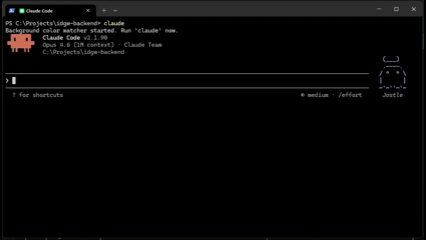

# Claude Code CLI — Terminal Background Watcher for Windows



A lightweight utility that changes your Windows Terminal background color based on Claude Code's current state. Glance at a tab and instantly know whether Claude is thinking, waiting for your input, or idle — no need to read any text.

## How It Works

Claude Code fires lifecycle hooks that write the current state to a small temp file. A PowerShell background watcher polls that file and sends [OSC 11](https://invisible-island.net/xterm/ctlseqs/ctlseqs.html#h3-Operating-System-Commands) escape sequences to change the terminal background color in real time.

| State | Default Color | Trigger |
|-------|--------------|---------|
| **Idle** | `#000000` (black) | Session starts, or Claude finishes a response |
| **Thinking** | `#003300` (dark green) | You submit a prompt |
| **Input needed** | `#332200` (dark amber) | Claude asks for permission or input |
| **Error** | `#330000` (dark red) | An API error ended the turn |
| **Subagent** | `#003333` (dark teal) | A background agent is running |
| **Compacting** | `#333300` (dark yellow) | Context compaction in progress — nearing context limit |
| **Session ended** | `#0C0C0C` (default) | Claude session closes — resets to your normal color |

Each terminal tab tracks its own session independently via `$env:WT_SESSION`.

## Prerequisites

- [Windows Terminal](https://aka.ms/terminal) (the OSC 11 sequences require it — cmd.exe and legacy conhost won't work)
- PowerShell 5.1+
- [Claude Code CLI](https://docs.anthropic.com/en/docs/claude-code) installed and available on your `PATH`

## Installation

### 1. Add Claude Code hooks

Merge the following into `C:\Users\<username>\.claude\settings.json`. If you already have hooks defined, add these entries alongside them — don't overwrite the entire file.

```json
{
  "hooks": {
    "UserPromptSubmit": [
      {
        "hooks": [
          {
            "type": "command",
            "shell": "powershell",
            "command": "\"thinking\" | Out-File -NoNewline \"$env:USERPROFILE\\.claude-bg-state-$env:WT_SESSION\""
          }
        ]
      }
    ],
    "Stop": [
      {
        "hooks": [
          {
            "type": "command",
            "shell": "powershell",
            "command": "\"idle\" | Out-File -NoNewline \"$env:USERPROFILE\\.claude-bg-state-$env:WT_SESSION\""
          }
        ]
      }
    ],
    "SessionStart": [
      {
        "hooks": [
          {
            "type": "command",
            "shell": "powershell",
            "command": "\"idle\" | Out-File -NoNewline \"$env:USERPROFILE\\.claude-bg-state-$env:WT_SESSION\""
          }
        ]
      }
    ],
    "Notification": [
      {
        "matcher": "idle_prompt|permission_prompt|elicitation_dialog",
        "hooks": [
          {
            "type": "command",
            "shell": "powershell",
            "command": "\"input\" | Out-File -NoNewline \"$env:USERPROFILE\\.claude-bg-state-$env:WT_SESSION\""
          }
        ]
      }
    ],
    "StopFailure": [
      {
        "hooks": [
          {
            "type": "command",
            "shell": "powershell",
            "command": "\"error\" | Out-File -NoNewline \"$env:USERPROFILE\\.claude-bg-state-$env:WT_SESSION\""
          }
        ]
      }
    ],
    "SubagentStart": [
      {
        "hooks": [
          {
            "type": "command",
            "shell": "powershell",
            "command": "\"subagent\" | Out-File -NoNewline \"$env:USERPROFILE\\.claude-bg-state-$env:WT_SESSION\""
          }
        ]
      }
    ],
    "SubagentStop": [
      {
        "hooks": [
          {
            "type": "command",
            "shell": "powershell",
            "command": "\"thinking\" | Out-File -NoNewline \"$env:USERPROFILE\\.claude-bg-state-$env:WT_SESSION\""
          }
        ]
      }
    ],
    "PreCompact": [
      {
        "hooks": [
          {
            "type": "command",
            "shell": "powershell",
            "command": "\"compact\" | Out-File -NoNewline \"$env:USERPROFILE\\.claude-bg-state-$env:WT_SESSION\""
          }
        ]
      }
    ],
    "PostCompact": [
      {
        "hooks": [
          {
            "type": "command",
            "shell": "powershell",
            "command": "\"thinking\" | Out-File -NoNewline \"$env:USERPROFILE\\.claude-bg-state-$env:WT_SESSION\""
          }
        ]
      }
    ],
    "SessionEnd": [
      {
        "hooks": [
          {
            "type": "command",
            "shell": "powershell",
            "command": "\"reset\" | Out-File -NoNewline \"$env:USERPROFILE\\.claude-bg-state-$env:WT_SESSION\""
          }
        ]
      }
    ]
  }
}
```

### 2. Create the background watcher script

Save this as `C:\Users\<username>\.claude\bg-watcher.ps1`:

```powershell
param(
    [string]$IdleColor     = "#000000",
    [string]$ThinkingColor = "#003300",
    [string]$InputColor    = "#332200",
    [string]$ErrorColor    = "#330000",
    [string]$SubagentColor = "#003333",
    [string]$CompactColor  = "#333300",
    [string]$DefaultColor  = "#0C0C0C"
)

$stateFile = "$env:USERPROFILE\.claude-bg-state-$env:WT_SESSION"
"idle" | Out-File -NoNewline $stateFile

$global:ClaudeBgDefaultColor = $DefaultColor
$global:ClaudeBgStateFile = $stateFile

[Console]::Write("$([char]27)]11;$IdleColor$([char]7)")

$runspace = [runspacefactory]::CreateRunspace()
$runspace.Open()

$ps = [powershell]::Create().AddScript({
    param($stateFile, $IdleColor, $ThinkingColor, $InputColor, $ErrorColor, $SubagentColor, $CompactColor, $DefaultColor)

    $esc = [char]27
    $bel = [char]7
    $lastState = "idle"

    while ($true) {
        if (Test-Path $stateFile) {
            $state = (Get-Content $stateFile -Raw).Trim()
            if ($state -ne $lastState) {
                $color = switch ($state) {
                    "thinking" { $ThinkingColor }
                    "idle"     { $IdleColor }
                    "input"    { $InputColor }
                    "error"    { $ErrorColor }
                    "subagent" { $SubagentColor }
                    "compact"  { $CompactColor }
                    "reset"    { $DefaultColor }
                    default    { $null }
                }
                if ($color) {
                    [Console]::Write("$esc]11;$color$bel")
                    $lastState = $state
                }
            }
        }
        Start-Sleep -Milliseconds 200
    }
}).AddParameters(@{
    stateFile     = $stateFile
    IdleColor     = $IdleColor
    ThinkingColor = $ThinkingColor
    InputColor    = $InputColor
    ErrorColor    = $ErrorColor
    SubagentColor = $SubagentColor
    CompactColor  = $CompactColor
    DefaultColor  = $DefaultColor
})

$ps.Runspace = $runspace
$global:ClaudeBgHandle = $ps.BeginInvoke()
$global:ClaudeBgPs = $ps
$global:ClaudeBgRunspace = $runspace

Write-Host "Background color watcher started. Run 'claude' now."

Register-EngineEvent PowerShell.Exiting -Action {
    $global:ClaudeBgPs.Stop()
    $global:ClaudeBgRunspace.Close()
    [Console]::Write("$([char]27)]11;$($global:ClaudeBgDefaultColor)$([char]7)")
    if ($global:ClaudeBgStateFile -and (Test-Path $global:ClaudeBgStateFile)) {
        Remove-Item $global:ClaudeBgStateFile
    }
} | Out-Null
```

> **Why a runspace?** PowerShell `Start-Job` runs in a separate process and can't write escape sequences to the current terminal. A runspace shares the same process, so it can control the terminal directly while polling in the background.

### 3. Add the wrapper function to your PowerShell profile

Add this to `C:\Users\<username>\Documents\WindowsPowerShell\Microsoft.PowerShell_profile.ps1`:

```powershell
function claude {
    . "$env:USERPROFILE\.claude\bg-watcher.ps1"

    & claude.cmd @args

    if ($global:ClaudeBgPs) {
        $global:ClaudeBgPs.Stop()
        $global:ClaudeBgRunspace.Close()
    }
    [Console]::Write("$([char]27)]11;$($global:ClaudeBgDefaultColor)$([char]7)")
    if ($global:ClaudeBgStateFile -and (Test-Path $global:ClaudeBgStateFile)) {
        Remove-Item $global:ClaudeBgStateFile
    }
}
```

This wraps the real `claude` command so the watcher starts automatically and cleans up (stops the runspace, resets the color, removes the temp file) when Claude exits.

## Usage

Open a new terminal tab — your profile loads automatically — and run `claude` as usual. The background color will change based on Claude's state.

To apply in an already-open shell without restarting it:

```powershell
. $PROFILE
```

## Customizing Colors

The watcher accepts parameters for each state color. To use your own palette, edit the `claude` wrapper function to pass them:

```powershell
. "$env:USERPROFILE\.claude\bg-watcher.ps1" -IdleColor "#1a1a2e" -ThinkingColor "#0f3460" -InputColor "#533a1e" -ErrorColor "#3a0f0f" -SubagentColor "#0f3a3a" -CompactColor "#3a3a0f" -DefaultColor "#0C0C0C"
```

Colors are hex strings (`#RRGGBB`). The `DefaultColor` is what the terminal resets to when the session ends — match it to your Windows Terminal color scheme's background.

## Troubleshooting

**Background color stuck after a crash?** If the terminal process is killed (not closed cleanly), the cleanup handler won't fire. Reset manually:

```powershell
# Reset the terminal background color
Write-Host "$([char]27)]11;#0C0C0C$([char]7)" -NoNewline
# Remove stale state files
Remove-Item "$env:USERPROFILE\.claude-bg-state-*"
```

## Uninstalling

1. Remove the `claude` function from your PowerShell profile (`Microsoft.PowerShell_profile.ps1`).
2. Delete `C:\Users\<username>\.claude\bg-watcher.ps1`.
3. Remove the hook entries from `C:\Users\<username>\.claude\settings.json` (or delete the file if it only contains these hooks).
4. Clean up any leftover state files: `Remove-Item "$env:USERPROFILE\.claude-bg-state-*"`.

## Author

[aewyn](https://github.com/aewyn)
